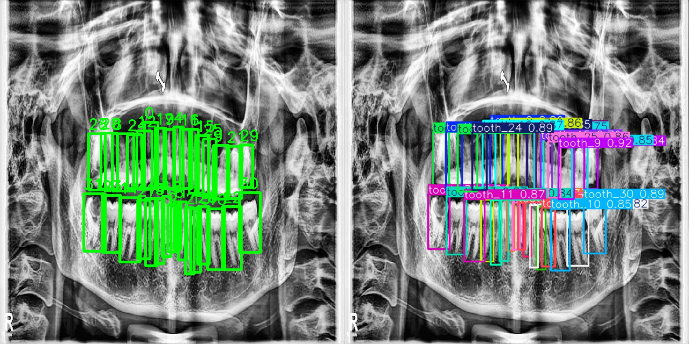
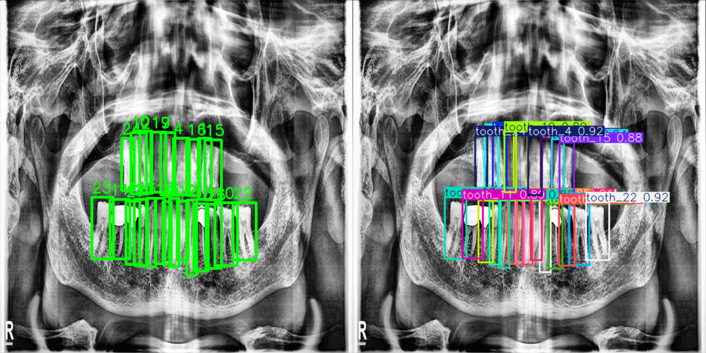
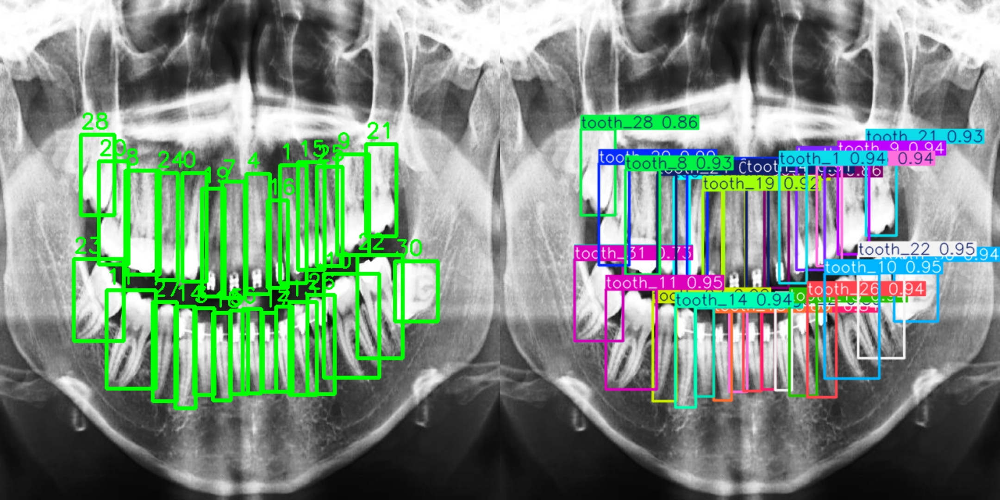
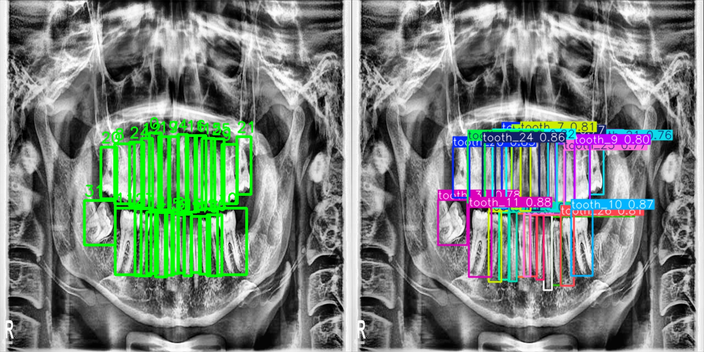
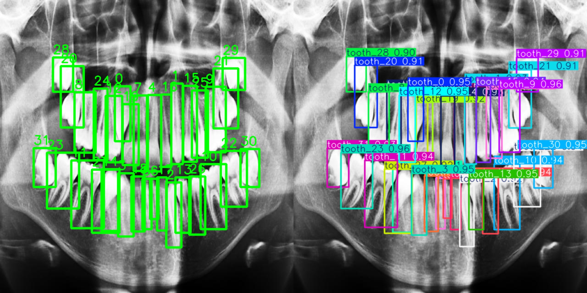
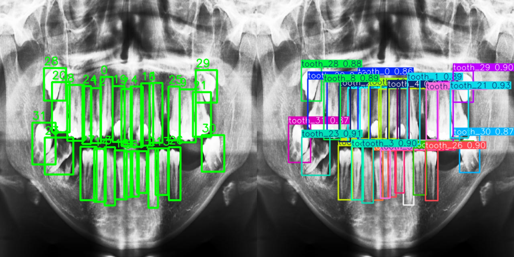

# 🦷 Tooth Number Detection using YOLO11


## 🚀 Live Demo (Hugging Face App)

You can try the trained model directly using the deployed Hugging Face Space:

🔗 **Tooth Number Detection App:**  
https://huggingface.co/spaces/satyaaa-m/yolo-tooth-numbering

Upload a dental X-ray image to see real-time tooth detection and numbering predictions.

---

## 📌 Overview
This project focuses on **automatic tooth detection and numbering from dental X‑ray images** using a YOLO based object detection model. 

The aim is to build a fast and accurate system that can help in **dental charting, diagnosis assistance, and clinical workflow automation**.

---

## 📂 Dataset
- ~500 Dental X‑ray images
- Bounding box annotations in **YOLO format**
- **32 Tooth Classes**
- Train / Validation Split → **80 / 20**

---

## 🤖 Model Details
- Model Used → **YOLO11m (Pretrained)**
- Image Size → **768**
- Batch Size → **12**
- Epochs → **100**
- Cosine LR Scheduler Enabled
- Transfer Learning used for faster convergence

---

## 📊 Results
| Metric | Score |
|-------|------|
| Precision | 0.981 |
| Recall | 0.981 |
| mAP@0.5 | 0.986 |
| mAP@0.5:0.95 | 0.816 |

Model achieved strong localization accuracy even in **crowded dental regions**.

---

## ⚡ Inference Speed
- **0.0408 sec per image**
- ~ **24.5 FPS**

Suitable for real‑time or near real‑time clinical assistance systems.

---

## 🖼️ Example Predictions
Below are some sample prediction outputs from the trained model:

## 🖼️ Example Predictions

<p align="center">
  
  
</p>

<p align="center">
  
  
</p>

<p align="center">
  
  
</p>


These images show bounding box predictions with correct tooth numbering.

---

## 🛠️ Installation

```bash
git clone <your-repo-link>
cd tooth-numbering-yolo
pip install -r requirements.txt
```

---

## 🚀 Training

```bash
yolo detect train data=data.yaml model=yolo11m.pt imgsz=768 epochs=100 batch=12
```

Training results will be saved inside:

```
runs/detect/train/
```

---

## 🔎 Inference

```python
from ultralytics import YOLO

model = YOLO("runs/detect/train/weights/best.pt")
model.predict(source="images/val", save=True)
```

Predictions will be exported inside:

```
prediction_exports/
```

---

## 📁 Project Structure

```
TOOTH-NUMBERING-YOLO
│
├── prediction_exports/
│   ├── sample_1.jpg
│   ├── sample_2.jpg
│   └── ...
│
├── runs/
├── Tooth_number.ipynb
├── Tooth numbering Yolo Report.pdf
├── ToothNumber_TaskDataset.zip
├── requirements.txt
└── README.md
```

---

## 👨‍💻 Author

**Satyam Yadav**  
🔗 [GitHub Profile](https://github.com/sattyaaa)


